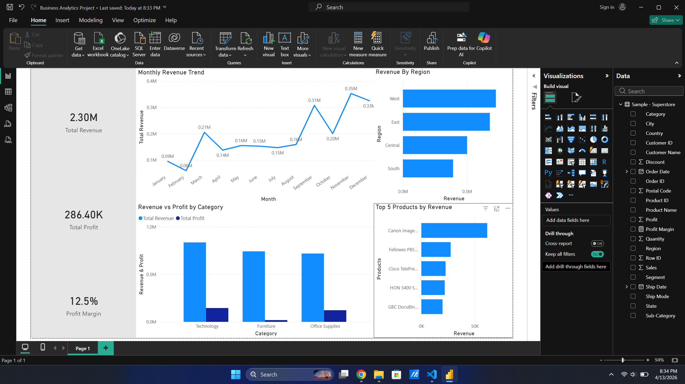

# 📊 E-Commerce Sales Analysis

## 📌 Objective
Analyze e-commerce sales data to identify key revenue drivers, profitability issues, and seasonal trends to support business decision-making.

---

## 🛠 Tools Used
- Python (Pandas)
- SQL
- Power BI

---

## 📂 Dataset
Sample Superstore dataset containing 9,994+ transaction records including sales, profit, customer, product, and regional data.

---

## ⚙️ Process
- Cleaned and prepared data using Python (Pandas)
- Converted date fields and engineered features (Month, Year, Profit Margin)
- Performed data analysis using grouping and aggregation techniques
- Built an interactive dashboard in Power BI to visualize insights

---

## 📊 Dashboard

---

## 🔍 Key Insights
- Top 5 products contributed only ~6.6% of total revenue indicating a highly diversified product portfolio
- Furniture category generated high revenue but low profit, highlighting margin inefficiencies
- Revenue peaked in Q4 (November–December) indicating strong seasonal demand
- Sales distribution is spread across multiple categories and regions reducing dependency risk

---

## 📈 Conclusion
The analysis highlights opportunities to improve profitability, optimize pricing strategies, and leverage seasonal demand through targeted planning and inventory management.

---

## 📌 Dataset Source
The dataset used in this project is the Sample Superstore dataset obtained from Kaggle and is widely used for data analysis and visualization practice.
